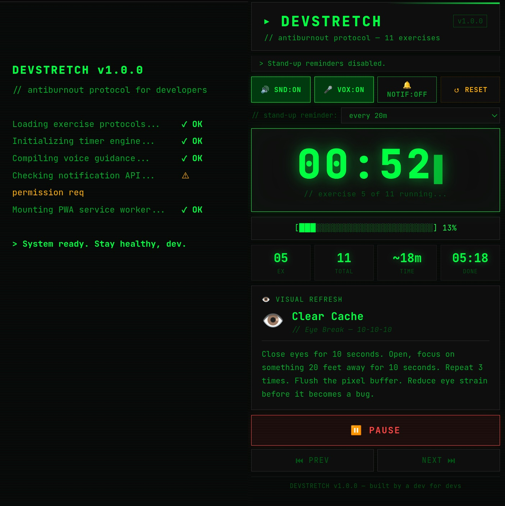

# ▸ DevStretch — Antiburnout Protocol

**[🚀 Live Demo](https://devstretch.vercel.app)**

<p>
  
</p>

A PWA for developers who forget they have a body. 11 dev-themed stretches with automatic timers, voice guidance, and a stretch reminder countdown — ~18 minutes to fix what hours of coding breaks.

---

## Features

- **Stretch reminder countdown** — set a 20/45/60 min timer; alarm + voice fires when time is up. Start, pause, and reset independently of the workout
- **11 dev-themed exercises** — `git commit --water`, `Lint Your Posture`, `Deploy to Standing Position`, and more
- **Voice guidance** — announces each exercise, halfway points, and countdowns (toggleable)
- **Sound effects** — beeps, countdowns, completion sounds (toggleable)
- **CLI progress bar** — `[████████░░░░░░░░] 50%`
- **Boot sequence** — because every good dev tool needs a startup screen
- **PWA** — installable on desktop and mobile, works fully offline
- **Dark terminal aesthetic** — green on black, JetBrains Mono

---

## Exercises

| # | Dev Name | Real Name |
|---|----------|-----------|
| 1 | Review That Code | Neck Stretch |
| 2 | Roll Back | Shoulder Rolls |
| 3 | Prevent Carpal Tunnel PR | Wrist Stretches |
| 4 | Deploy to Standing Position | Sit to Stand |
| 5 | Clear Cache | Eye Break |
| 6 | Refactor Your Spine | Seated Back Twist |
| 7 | Offline Mode | Walk Away |
| 8 | Memory Garbage Collection | Box Breathing |
| 9 | Extend Your Reach | Overhead Arm Stretch |
| 10 | Lint Your Posture | Posture Check |
| 11 | git commit --water | Hydration Reminder |

---

## Usage

### Running locally

Any static file server works — no build step required:

```bash
npx serve .
# or
python -m http.server 8080
```

Then open `http://localhost:8080`. Hard-refresh (`Ctrl+Shift+R`) after changes to bypass the service worker cache.

### Testing the stretch reminder

1. Select an interval (20/45/60 min) in the reminder row
2. Click `▶ START` — the main timer display counts down
3. Try `⏸ PAUSE` and `↺ RESET`
4. When the countdown hits zero, an alarm plays and voice says it's time to stretch

To test the fired state instantly, open the browser console and run:

```javascript
window.workoutTimer.reminder.start(0.05) // fires in ~3 seconds
```

---

## Stack

- **Vanilla HTML / CSS / JS** — no frameworks, no build tools
- **Web Speech API** — voice guidance
- **Web Notifications API** — stretch reminders via service worker
- **Service Worker** — offline support and PWA installability
- **JetBrains Mono** — because the font matters

---

## Roadmap

- [x] Stretch reminder countdown with start/pause/reset
- [ ] Custom exercise editor — add your own stretches
- [ ] Session history — track your streaks
- [ ] Spotify / music integration — coding playlist during Offline Mode
- [ ] More exercise sets — eyes, hands, full body

---

## License

[MIT](LICENSE)

---

*// It's a feature, not a bug.*
