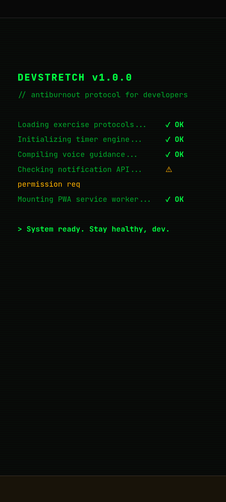
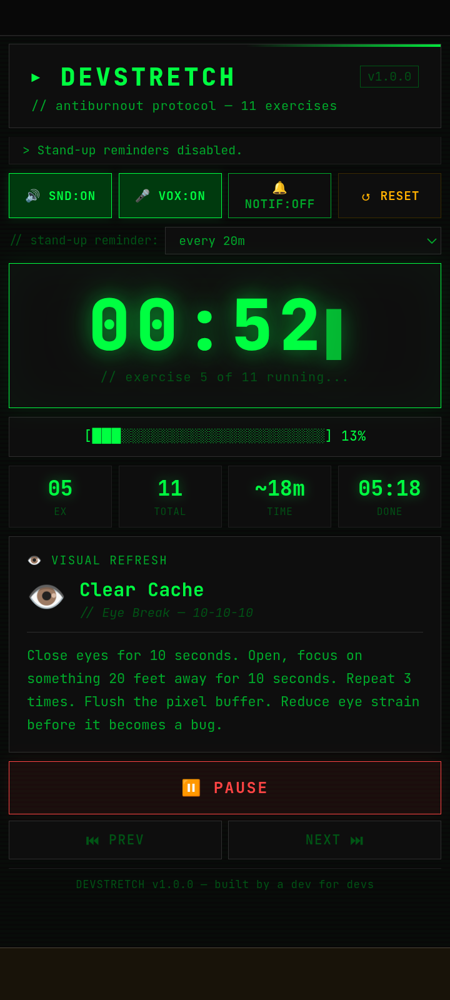

# ▸ DevStretch - Antiburnout Protocol

**[🚀 Live Demo](https://devstretch.vercel.app)**

---

## What is this?

DevStretch is a PWA built for developers who forget they have a body:)

You know the feeling - you sit down to fix one bug, look up, and it's been 4 hours. Your neck is a deprecated API. Your posture has more issues than your codebase.

DevStretch is 11 dev-themed exercises with automatic timers, voice guidance, and stand-up reminders. ~18 minutes. Just you, your chair, and the will to not get RSI.

---

## Features

- **11 dev-themed exercises** - with names like `git commit --water`, `Lint Your Posture`, and `Deploy to Standing Position`
- **Voice guidance** - tells you what to do and when (toggleable)
- **Sound effects** - beeps, countdowns, completion sounds (toggleable)
- **CLI progress bar** - because `[████████░░░░░░░░] 50%` is more satisfying than a boring bar
- **Boot sequence** - because every good dev tool deserves a startup screen
- **PWA** - installable on desktop and mobile, works offline
- **Dark terminal aesthetic** - green on black, JetBrains Mono

---

## Exercises

| # | Dev Name | Real Name |
|---|----------|-----------|
| 1 | Review That Code | Neck Stretch |
| 2 | Roll Back | Shoulder Rolls |
| 3 | Prevent Carpal Tunnel PR | Wrist Stretches |
| 4 | Deploy to Standing Position | Sit to Stand |
| 5 | Clear Cache | Eye Break |
| 6 | Refactor Your Spine | Seated Back Twist |
| 7 | Offline Mode | Walk Away |
| 8 | Memory Garbage Collection | Box Breathing |
| 9 | Extend Your Reach | Overhead Arm Stretch |
| 10 | Lint Your Posture | Posture Check |
| 11 | git commit --water | Hydration Reminder |

---

## Stack

- **Vanilla HTML / CSS / JS** - no frameworks, no build tools
- **Web Speech API** - voice guidance
- **Web Notifications API** - stand-up reminders via service worker
- **Service Worker** - offline support and PWA installability
- **JetBrains Mono** - because the font matters

---

## Built for

The [DEV Weekend Challenge](https://dev.to) - community: developers everywhere who are one bad posture day away from a doctor's visit.

---

## What's next

- [ ] Custom exercise editor - add your own stretches
- [ ] Session history - track your streaks
- [ ] Spotify / music integration - coding playlist during Offline Mode
- [ ] More exercise sets - eyes, hands, full body

---

*// It's a feature, not a bug.*